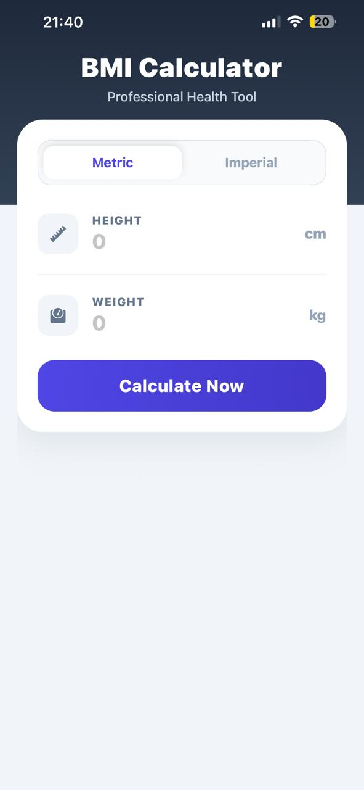
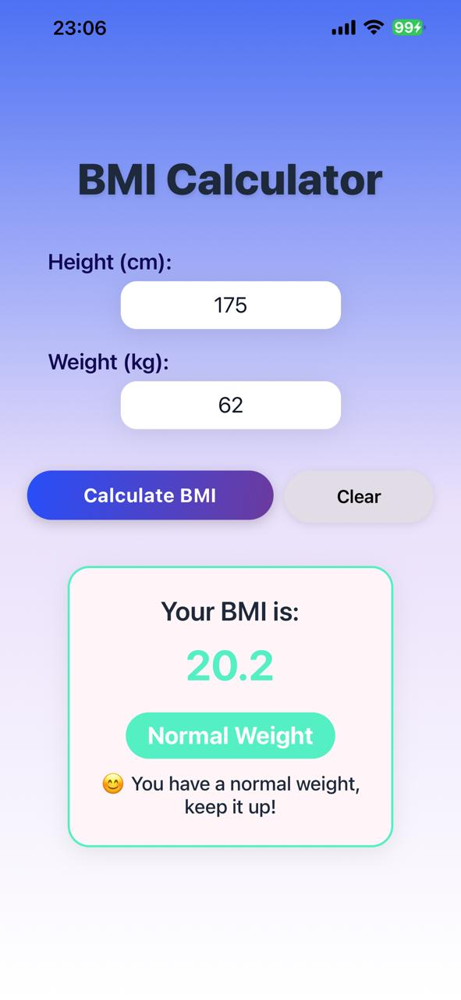
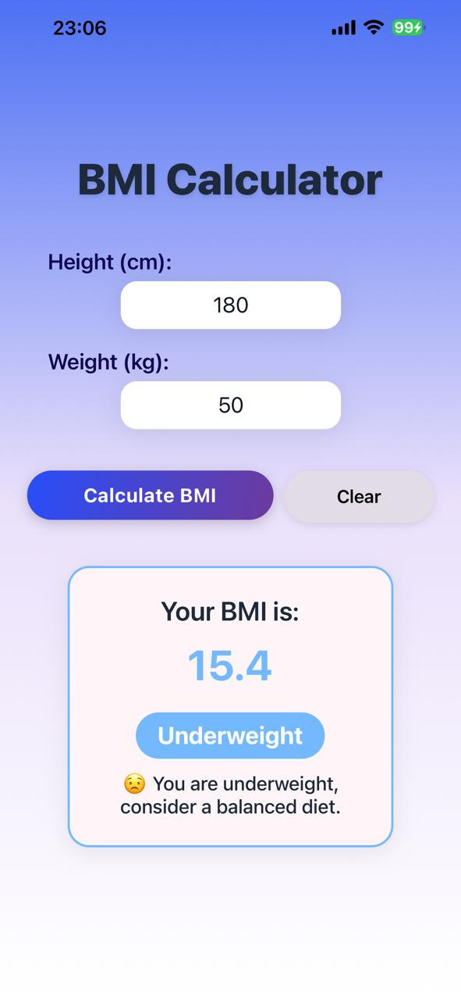
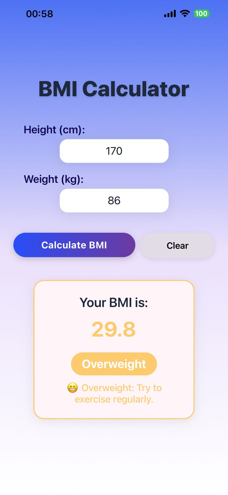
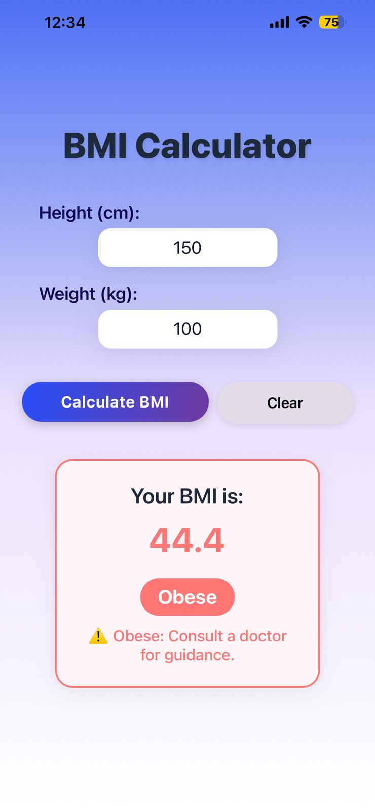
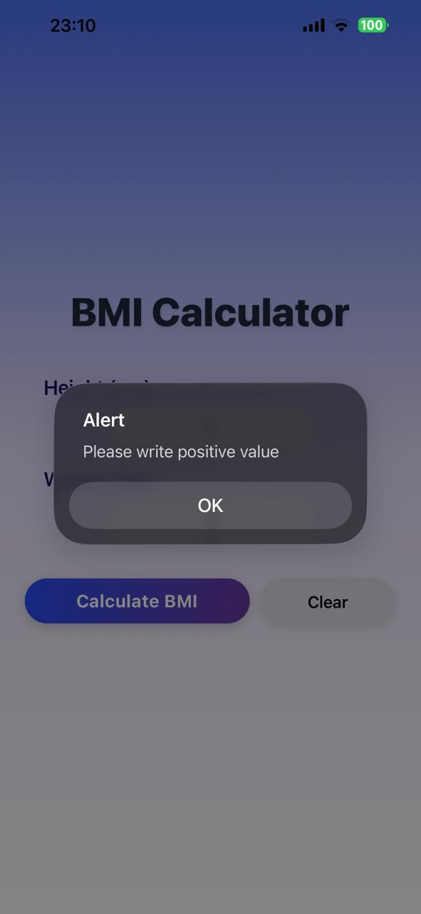
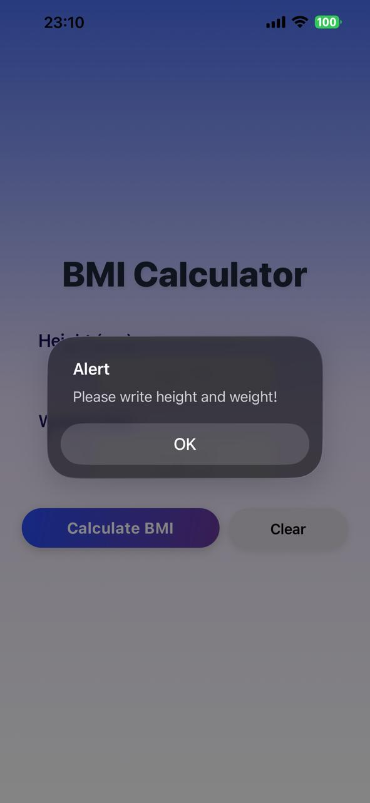

# 📱 BMI Calculator App

A modern and interactive **Body Mass Index (BMI)** calculator built with **React Native (Expo)**.  
This project was developed as part of the *Mobile App Development – Week 2 Assignment*.

---

## 🌟 Features

✅ Input height (cm) and weight (kg)  
✅ Calculates BMI instantly with validation  
✅ Displays BMI value and category (Underweight / Normal / Overweight / Obese)  
✅ Color-coded results for easy visual feedback  
✅ “Clear” button to reset all fields  
✅ Motivational message and health tips based on BMI  
✅ Beautiful gradient UI with smooth animations (fade and scale effects)  
✅ Fully responsive layout with keyboard handling

---

## 🧮 BMI Formula

**Formula:**

**BMI = weight (kg) / [height (m)]²**

**Example:**  
If weight = 70 kg and height = 1.75 m  
→ BMI = 70 / (1.75 × 1.75) = **22.9**

| Category | Range | Color |
|-----------|--------|--------|
| Underweight | < 18.5 | 🔵 Blue |
| Normal Weight | 18.5 – 24.9 | 🟢 Green |
| Overweight | 25.0 – 29.9 | 🟡 Yellow |
| Obese | ≥ 30.0 | 🔴 Red |

---

## ⚙️ How to Run the App

1. Install dependencies:
   ```bash
   npm install

2. Start Expo development server
    ```bash
    npm start

3. Run on device or emulator
- 📱 Scan the QR code with Expo Go (iOS / Android)
- 💻 Or press w to open the web version

🧠 Technologies Used
- React Native,
- Expo,
- expo-linear-gradient,
- Animated API (fade + scale transitions)


🧩 Folder Structure
- App.js
- assets/
- node_modules/
- package.json

All main logic is contained in App.js (no external components needed).

💬 Example Messages:
- 😟 You are underweight, consider a balanced diet.
- 😊 You have a normal weight, keep it up!
- 😬 You are overweight, try to exercise regularly.
- ⚠️ You are obese, consult a doctor for guidance.


🧑‍💻 Student
    Rinesa Bislimi
📅 Mobile App Development – Week 2 Project
📚 Guided by: Professor Agon Bajgora


## 🏁 Notes
This project fulfills all required and bonus criteria:
- Full functionality ✅
- Clean code structure ✅
- Enhanced UX (animations + tips) ✅
- Custom styling ✅
- Validated and runs without errors ✅


## 🖼️ Screenshots

Below are some screenshots from the **BMI Calculator App**:

### 🏠 Home Screen


--- 

### 📊 BMI Result Screen
### 😊Normal weight


### 😟Underweight


### 😬Overweight


### ⚠️Obese


---

### ⚠️ Validation Alert

### - Negative number


### - Null value



