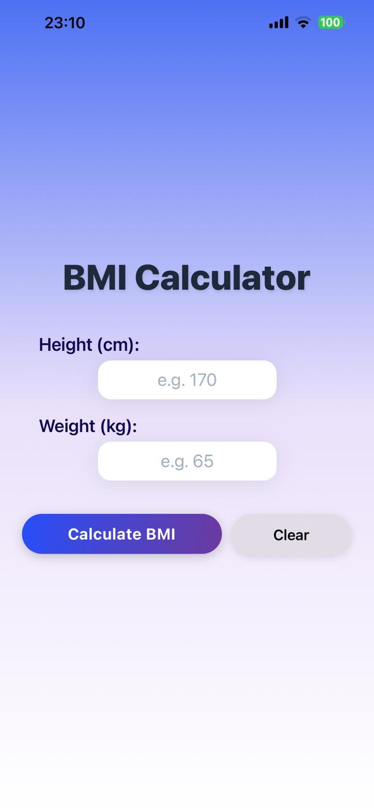

# BMI Calculator App

A modern, interactive, and professional Body Mass Index (BMI) calculator built with React Native (Expo). This project was developed as part of the Mobile App Development – Week 3 Assignment.

## Features

-   **Dual Unit Support:** Switch between Metric (cm/kg) and Imperial (in/lbs).
-   **Persistent History:** Saves previous BMI calculations locally using AsyncStorage.
-   **Animated Results:** Smooth UI transitions using the Animated API.
-   **Visual BMI Gauge:** Indicator bar showing BMI position on the health scale.
-   **Input Validation:** Alerts for empty, zero, or negative values.
-   **Premium UI:** Gradient design with a fully responsive layout.
-   **History Management:** Delete individual records or clear all history.

## BMI Formula

The Body Mass Index is calculated using the standard formula:BMI = weight (kg) / (height (m) * height (m))

## Health Categories and Ranges

Category

BMI Range

Color

Underweight

< 18.5

Blue

Normal Weight

18.5 – 24.9

Green

Overweight

25.0 – 29.9

Yellow

Obese

>= 30.0

Red

---

## How to Run the App

1.  Clone the repository:`git clone <your-repository-url>`
    
2.  Install dependencies:`npm install`
    
3.  Start the Expo server:`npx expo start`
    
4.  Run the app:
    
    -   Scan the QR code with Expo Go (Android / iOS).
    -   Press 'w' for the web version.

---

## Technologies Used

-   React Native & Expo
-   AsyncStorage (Local storage)
-   Expo Linear Gradient
-   Expo Vector Icons
-   Animated API

---

## Project Information

-   **Student:** Rinesa Bislimi
-   **Course:** Mobile App Development – Week 2 Project
-   **Instructor:** Professor Agon Bajgora

### Project Status

-   Full Functionality: YES
-   Clean Code: YES
-   Enhanced UX: YES

---

## 📸 Screenshots

| Home Screen | BMI Metric | BMI Imperial | Alerts | History View |
| :---: | :---: | :---: | :---: | :---: |
|  |  |  |  |  |